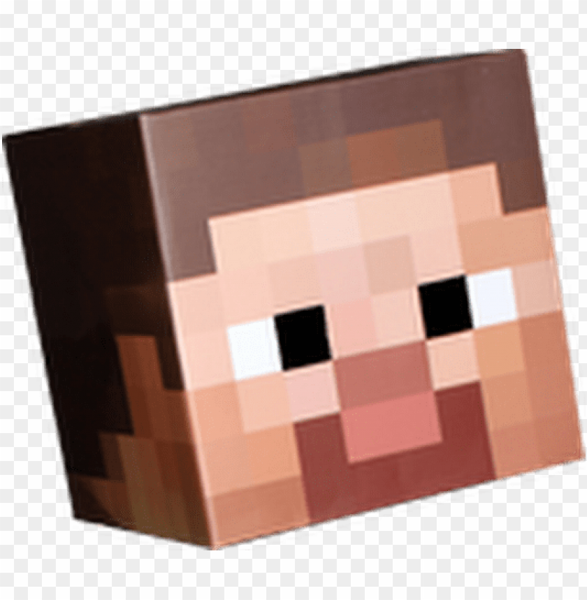

<!-- PROJECT LOGO -->
 

    
  

  <h3 align="center">Aether Realm OOP</h3>

  

    An awesome GUI for Object Oriented Game, Presented by IF2210
     

<!-- TABLE OF CONTENTS -->

  
Table of Contents

  <ol>
    <li>
      <a href="#about-the-project">About The Project</a>
      <ul>
        <li><a href="#built-with">Built With</a></li>
      </ul>
    </li>
    <li>
      <a href="#getting-started">Getting Started</a>
      <ul>
        <li><a href="#prerequisites">Prerequisites</a></li>
      </ul>
    </li>
    <li><a href="#usage">Usage</a></li>
    <li><a href="#contact">Contact</a></li>
  </ol>

<!-- ABOUT THE PROJECT -->
## About The Project

This is a Object Oriented Games which developed by JavaFX. The GUI was built using Gradle. This program is built to fulifill the requisites of Subject IF2210 Object Oriented Programming. 

(<a href="#top">back to top</a>)

### Built With

The library that are used on this project are

* Javac
* JDK
* JavaFX
* Gradle
* Java.util

(<a href="#top">back to top</a>)

<!-- GETTING STARTED -->
## Getting Started

This project run on Java virtual machine. You need to fulifill the prerequisites before run the program.
The program will open a window that shows the game on GUI.

### Prerequisites

Before run this program you may need to install
* Javac
* JDK version 8

(<a href="#top">back to top</a>)

<!-- USAGE EXAMPLES -->
## Usage
To run this program you can type
 
`./gradlew run`
 
on your terminal. Before run the program, make sure you are on root folder (/oop-aether-realm).
The command will run your main files. In this program, the main program is AetherWars.java.

(<a href="#top">back to top</a>)

<!-- CONTACT -->
## Contact
This program was built by:
* 13520043 / Muhammad Risqi Firdaus
* 13520049 / Aditya Prawira Nugroho
* 13520055 / Christopher Jeffrey
* 13520058 / Kristo Abdi Wiguna
* 13520079 / Ghebyon Tohada Nainggolan
* 13520151 / Rizky Ramadhana P.K.
